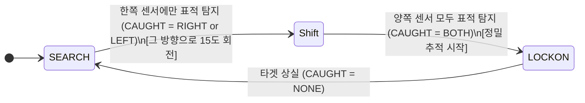

# Guided Control System Simulator (STM32 & FreeRTOS)

> **STM32F103RB** 환경에서 **FreeRTOS**를 활용하여 구현한 시스템입니다. 두 개의 초음파 센서로 목표를 추적하고, PID 제어 알고리즘을 통해 서보모터를 정밀 제어합니다.

## 🎬 데모 영상
* **좌측:** 유도센서 하드웨어 구동 모습
* **우상단:** 터미널 결과 출력 (양쪽 센서 측정값, PID 출력값, 현재 상태, 각 태스크 잔여 스택 공간)

https://github.com/user-attachments/assets/b64add12-2f93-4af2-bfcb-d56fe05c2706

> **[동작 시나리오]** `SEARCH_MODE` ➔ `LOCKON_MODE` ➔ `SEARCH_MODE` 상태 변환

---

## 🛠 기술 스택

| 분류 | 상세 항목 |
| :--- | :--- |
| **Hardware** | STM32F103RB (ARM Cortex-M3), HC-SR04 초음파 센서 (2개), SG-90 서브 모터 (1개) |
| **Software** | STM32CubeIDE, STM32CubeMX, Putty, SEGGER SystemView (디버깅용) |
| **OS / Language** | FreeRTOS / C Language |

---

## 🏗 설계 구조

### 1. 멀티태스크 분류 (Real-time Task Scheduling)
FreeRTOS의 우선순위 스케줄링을 활용하여 센서 데이터 수집, 제어 연산, 모터 출력을 독립적인 태스크로 분리했습니다.

* **`Task_sensor` (Priority 2 / 주기: 20ms)**
  * 20ms 주기로 초음파 센서에 Trigger 신호를 인가합니다.
* **`Task_Control` (Priority 3 / 주기: 20ms)**
  * 수신된 거리 및 각도 데이터를 바탕으로 PID 연산을 수행하여 날개(서보모터)를 제어합니다. 양쪽 센서의 거리 데이터를 비교하여 상태(FSM)를 전환합니다.
* **`Task_uart` (Priority 1 / 주기: 100ms)**
  * 현재 상태, 센서별 탐지 거리, PID 출력값, 각 태스크의 스택 남은 공간을 실시간 모니터링용으로 출력합니다.

### 2. 유도 상태 머신 (FSM)


---

## 🧠 제어 로직 & 신호 처리

타겟 추적의 정밀도를 높이기 위해 연속적인 시간 영역의 PID 제어식을 이산화(Discretization)하여 적용했습니다.

$$u(t) = K_p e(t) + K_i \int_{0}^{t} e(\tau) d\tau + K_d \frac{de(t)}{dt}$$

### 1. 가변 게인 PID 제어 (Gain Scheduling)
타겟과의 거리에 따라 제어 강도를 동적으로 조절하는 기법입니다.

* **배경:** 타겟이 멀리 있을 때는 오버슈트를 방지하기 위해 완만하게 추적하고, 가까워질수록 제어 반응성을 높여 추적 명중률을 향상시켜야 합니다.
* **구현:** 타겟과의 현재 거리($d_{current}$)에 반비례하도록 $K_p$ 게인을 실시간으로 업데이트합니다.

$$K_p(d) = K_{p,base} \times \frac{d_{ref}}{d_{current}}$$

### 2. 신호 처리 및 필터링 (Signal Processing)
저가형 초음파 센서의 하드웨어적 노이즈와 서보모터의 떨림(Jitter) 현상을 소프트웨어 필터로 극복했습니다.

#### 💡 링 버퍼 기반 이동 평균 필터 (Moving Average Filter)
센서값이 순간적으로 튀는 하드웨어 노이즈를 완화하기 위해 3개의 최근 데이터 평균을 활용합니다.
* **수식:** 
$$y[n] = \frac{1}{N} \sum_{i=0}^{N-1} x[n-i]$$

* **설정:** $N = 3$ (시스템 딜레이와 노이즈 억제력 간의 최적 타협점)

```C
uint16_t Buffer_Filter(Ring_Buffer_t *buffer, uint16_t distance)
{
    // 1. 합에서 가장 오래된 이전 값 차감
    buffer->sum -= buffer->dist[buffer->index];
    
    // 2. 최신 데이터 push 및 합산 최신화
    buffer->dist[buffer->index] = distance;
    buffer->sum += buffer->dist[buffer->index];
    
    // 3. 인덱스 순환 (Ring Buffer 구조)
    buffer->index = (buffer->index + 1) % BUFFER_SIZE;
    
    // 4. 최종 이동 평균값 반환
    return (buffer->sum) / BUFFER_SIZE;
}
```

#### 💡 지수 이동 평균 필터 (EMA Filter)
가공되지 않은 PID 출력값이 모터에 바로 인가되면 서보모터에 Jitter(진동) 현상이 발생합니다. 이를 방지하기 위해 직전 출력값과 현재 출력값을 평활화했습니다.
* **수식:** $y[n] = (1- \alpha) \cdot x[n] + \alpha \cdot y[n-1]$
* **설정:** $alpha = 0.3$ (현재 제어 데이터에 더 높은 가중치를 부여하여 움직이는 표적을 기민하게 추적)

```C
int16_t PID_Compute(int16_t curr_error)
{
    // 고정 소수점 연산을 위한 알파값 가중치 설정 (alpha = 0.3 의미)
    int16_t alpha = 3; 
    
    // ... [축약] 기존 PID 에러 및 제어량 연산 로직 ...
    
    // EMA 필터 적용: 이전 출력값과 현재 출력값의 보간
    int16_t filtered_output = ((pid.prev_output * alpha) + (output * (10 - alpha))) / 10;
    
    pid.prev_output = (int16_t)output;
    return filtered_output;
}
```

---

## 📊 주기 검증 & 메모리 및 저전력 최적화

### 1. 정밀 스케줄링 주기 검증 (Scheduling)
SEGGER SystemView 디버깅 툴을 통해 `Task_Control`과 `Task_sensor`가 RTOS 상에서 오차 없이 정확히 **20ms 주기**로 실행되고 있음을 타임라인 상에서 검증했습니다.


### 2. 메모리 최적화 (Stack Watermarking)
`uxTaskGetStackHighWaterMark()` 함수를 활용하여 런타임 중 각 태스크가 소비하는 최대 스택 메모리를 실시간으로 모니터링했습니다.

> **최적화 결과:** 불필요하게 크게 할당되어 있던 스택을 줄여, 각 태스크별로 최소한의 마진인 최소 **32 롱워드(Depth of Stack Memory = 128 bytes)** 공간만 남도록 스택 크기를 정밀 재조정하여 RAM 자원을 최적화했습니다.

### 3. 저전력 최적화 (Idle Hook + WFI)

실시간 태스크가 모두 Block 상태인 경우에는 CPU가 수행할 작업이 없습니다. 불필요한 전력 소모를 줄이기 위해 FreeRTOS의 **Idle Hook (`vApplicationIdleHook`)** 을 활용하여 Cortex-M3의 **WFI (Wait For Interrupt)** 명령을 실행하도록 구현했습니다.

```c
// Idle Task 마다 WFI 실행 ( 전력 효율 )
void vApplicationIdleHook(void)
{
	__WFI();
}
```
